# HURRICANE    STM32-Template

---

## 更新记录

版本号：V1.0.3	日期：26/4/13	说明：将`cleanup`脚本改为`python`编写来实现跨平台，改进`uart_ex`。

版本号：V1.0.2	日期：26/3/20	说明：添加 F1 模板（bare为裸机版本）。

版本号：V1.0.1	日期：26/3/19	说明：提供编译器与芯片型号切换支持。

版本号：V1.0.0	日期：26/3/18	说明：初次版本发布。

---

## 简介

本模板在[STM32-Template](https://github.com/Deadline039/STM32-Template)的基础上进行了改进，在对历史代码最大程度兼容的基础上，结合了[STM32CubeMX](https://www.st.com.cn/zh/development-tools/stm32cubemx.html)，[EIDE](https://em-ide.com/zh-cn/docs/intro/)，旨在提供一个便捷，灵活，高效的开发模板。

模板的优点如下：

- VSCode 提供现代化的代码编辑环境。
- CubeMX 提供的 UI 界面便捷地进行外设初始化。
- EDIE 提供的灵活工具链支持，能够使用 JLink ，AC6/GCC进行开发。

模板基于 CubeMX 6.17 版本，使用的硬件信息如下：

- F1 基于`stm32f103rct6`，使用的正点原子 MiniSTM32 开发板，外部晶振 8 MHz，工作频率 72 MHz。
- F4 基于`stm32f429vet6`，使用的开发板为战队25年[ F4 主控板](https://github.com/XJU-Hurricane-Team/2025R1/blob/main/F429VE_Develop_Board.xlsx)，外部晶振 25 MHz，工作频率 180 MHz。
- G4 基于`stm32g474vet6`，使用的开发板为战队25年[G4主控板](https://github.com/XJU-Hurricane-Team/2025R1/blob/main/G474VE_Develop_Board.xlsx)，外部晶振 25 MHz，工作频率 170 MHz。

感谢@[Deadline039](https://github.com/Deadline039/)提供的思路。

---

## 快速使用

克隆仓库到本地。

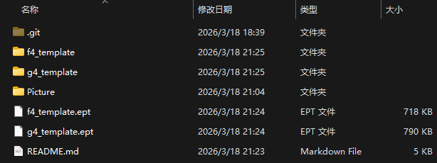

打开EIDE新建项目导入本地模板。

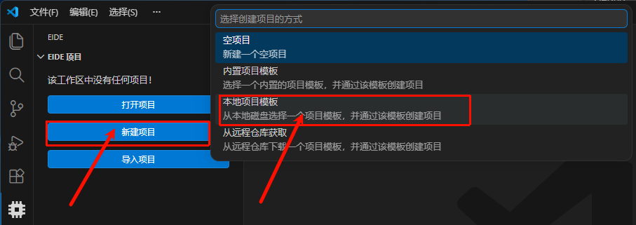

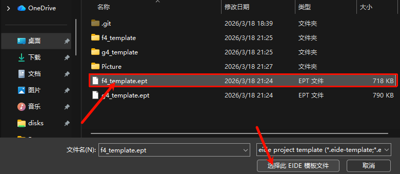

设置项目名称与存放路径。


---

## 工程切换

### 切换编译器

模板默认使用 AC6 编译器，对应的 CubeMX 中选择的是 MDK-ARM 工程。

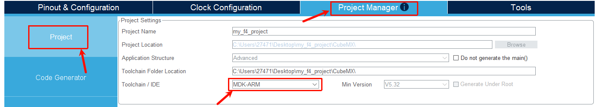

如果需要使用 GCC 编译器进行开发，仅需将 CubeMX 中的工程选项换为 Makefile 并重新生成代码。

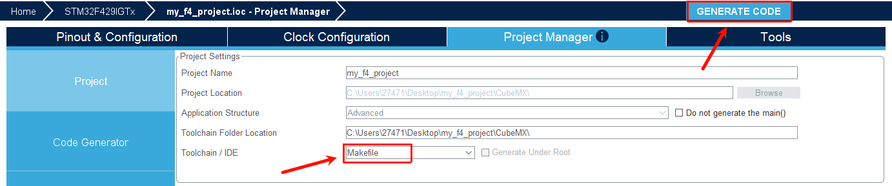

`cleanup.bat`脚本会自动处理EIDE的工具链设置，开发者仅需点击`Yes`重新加载配即可。


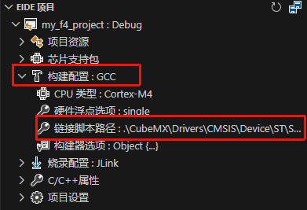

### 切换芯片型号

CubeMX 中自动支持芯片型号的切换，点击下图所示的选项后会自动查找匹配的型号。

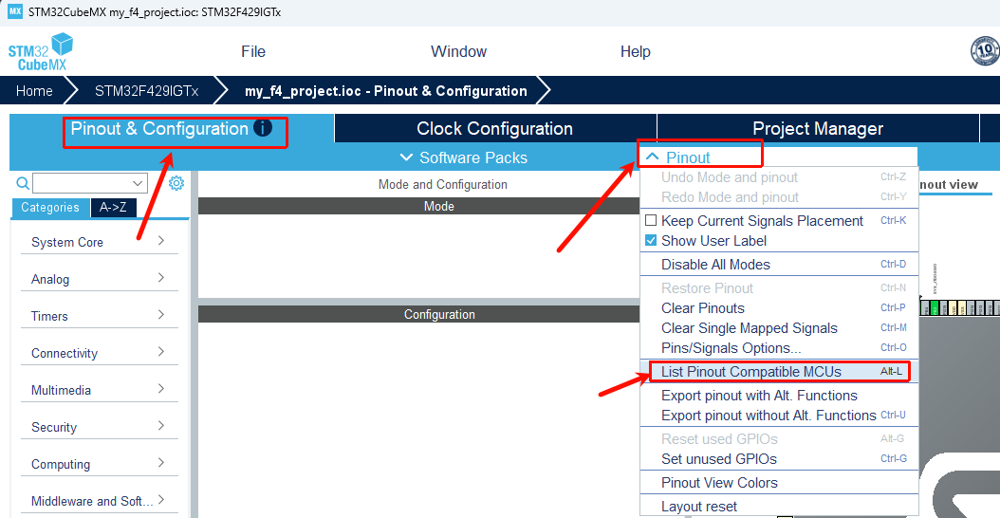

选择条件合适的芯片，点击`OK,Import`稍等片刻就能成功切换芯片型号。

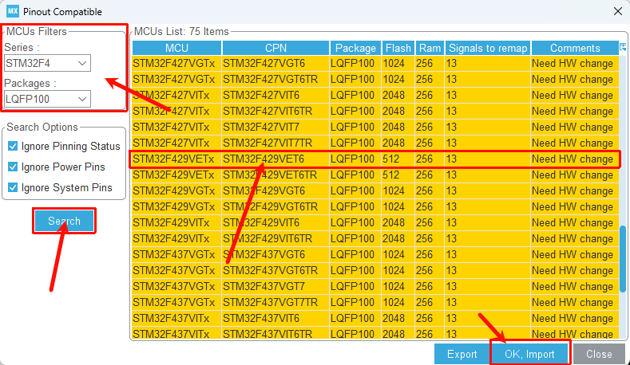

切换芯片后需要重新配置时钟树，设置工程信息。**注意工程路径要选在之前工程的根目录下，工程名设置为CubeMX** ，手动删除之前的.ioc文件。

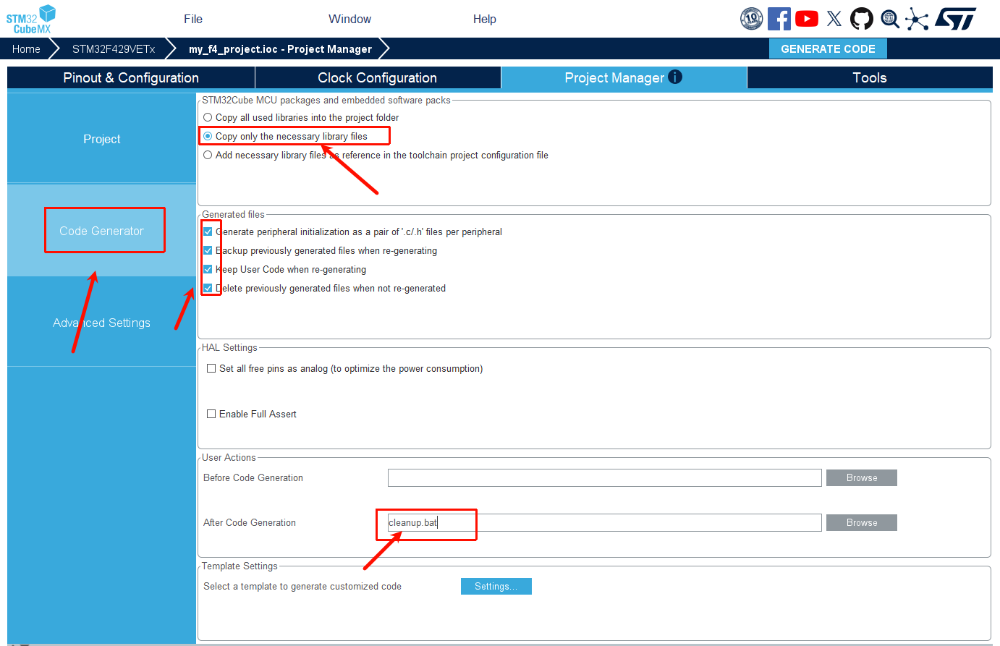

---

## 工程结构

以 F4 工程为例，模板的结构如下：

```bash
f4_template
├─.eide                        			# EIDE 工程配置。
├─.pack                        			# EIDE pack 依赖。
├─.vscode                      			# vscode 配置。
├── Build								# 构建生成的中间文件以及调试文件存放在此处。
│     └── Debug
├── CubeMX								# CubeMX 生成的文件存放在此文件夹下。
│     ├── Core 							# 外设初始化的文件存放在此文件夹下。
│     └── Drivers					
│       	├── CMSIS					# CMSIS 提供的内核和启动文件在此处存放。
│       	└── STM32F4xx_HAL_Driver 	# HAL库和 LL库的驱动文件存放在此处。
└── User
    ├── Application						# 存放应用层代码。
    ├── Bsp								# 存放片外外设驱动代码。
    ├── Middlewares						# 存放手动添加的中间件。
    │ 	└── FreeRTOS
    └── Utils							# 存放工具文件。

```

工程结构如图：

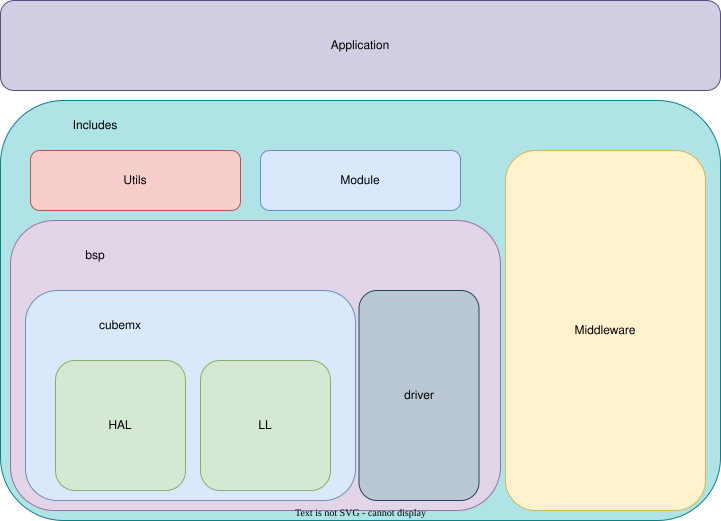

---

## 文件说明

### ~~cleanup.bat~~	cleanup.py

在`f4_template\CubeMX\` 路径下有名为`cleanup.bat`的脚本文件（已更新为`cleanup.py`）。

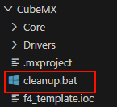

这个脚本会在 CubeMX 生成代码后自动调用，主要完成三个任务：

-  保持 .ioc 文件名称与工程名称同步。
-  重新生成 CubeMX/Core/Inc/cubemx.h 作为聚合包含头文件。
- 运行特定工具链的清理操作和 .eide/eide.yml 更新。


### usart_ex.c/h

在`f4_template\User\bsp\usart\` 路径下有`usart_ex.c/h`文件，该文件是串口的功能拓展文件，为串口的提供循环缓存区与相关函数以解决串口收发的过程中的痛点。

串口的拓展功能并非默认开启，模板提供了CMSIS 配置向导标记来手动开启。需要在保证串口DMA和中断正常开启的条件下，在`usart_ex.h`文件中右键选择图中选项，勾选要开启拓展功能的串口并保存。使用前调用`uart_ex_init`函数进行初始化。

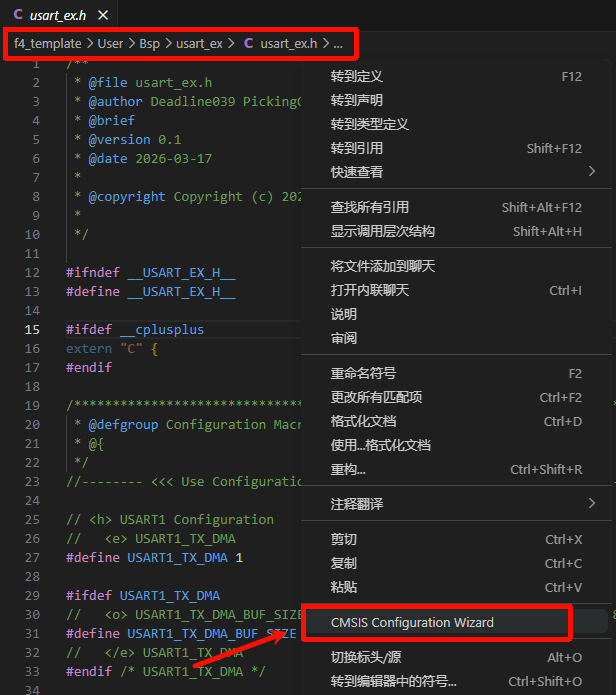

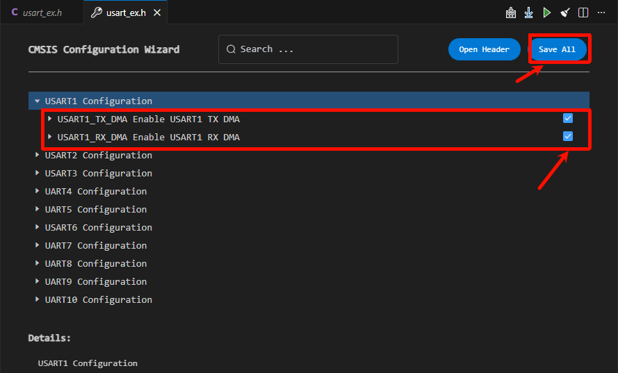

### canlist.h

在`f4_template\User\bsp\usart\` 路径下有`can_list.c/h`文件，该文件负责进行 CAN 节点回调处理，主要用于电机消息处理，使用是需要手动通过宏定义说明使能的 CAN 外设。具体设计细节见：[can_list - XJU-Hurricane-docs](https://xju-hurricane-team.github.io/Electrical/代码解析/can_list解析/)

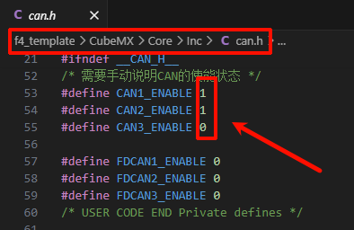

### syscalls.c

在`f4_template\User\bsp\syscall\` 路径下有`syscall.c`文件，该文件通过 LL库实现了标准输入输出函数重映射到串口。默认映射外设为`USART1`，可通过宏定义手动更改，更改前确认串口初始化已配置成功。

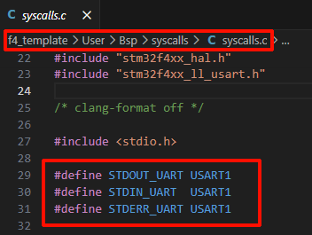


